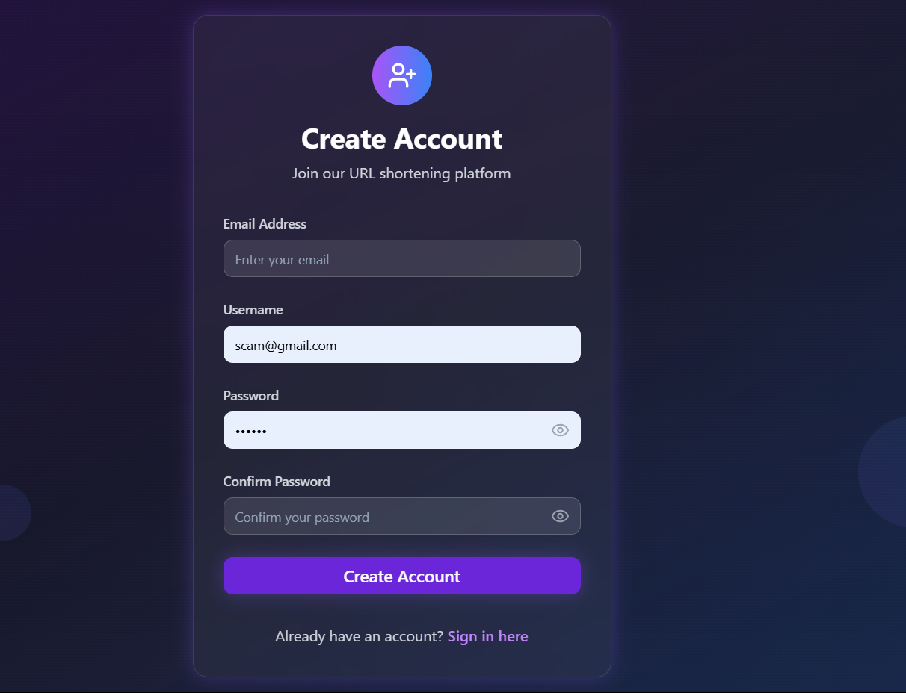
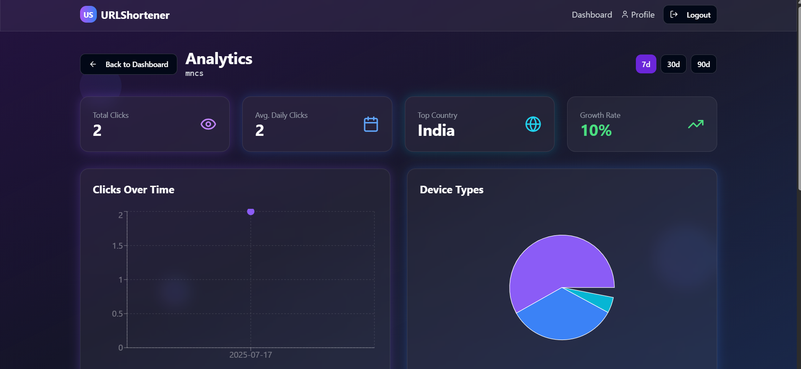

# 🔗 Scalable URL Shortener with Analytics

[](https://url-flow-analytics.vercel.app)
[](https://vurl.onrender.com)
[]()
[]()
[]()

> A production-ready, scalable URL shortening service with analytics, authentication, and admin approval features.

---

## 📌 Features

- ✂️ Shorten long URLs with unique aliases
- 📊 Track total clicks and usage analytics
- 🔐 Secure authentication (JWT-based)
- 👮 Admin approval for new users
- 📁 Redis caching for performance
- ⚙️ Role-based access control (User/Admin)
- 🎨 Clean, animated React UI with 3D backgrounds

---

## 🌐 Live Demo

- **Frontend**: [url-flow-analytics.vercel.app](https://url-flow-analytics.vercel.app)
- **Backend**: [vurl.onrender.com](https://vurl.onrender.com)

---

## 🖼️ Screenshots

| Signup Flow | Admin Panel | Analytics |
|-------------|-------------|-----------|
|  |  |  |

> 📌 Place your screenshots in a folder called `assets/` in your root directory. Rename the images as `signup.png`, `admin-panel.png`, and `analytics.png` accordingly.

---

## 🔧 Tech Stack

### Frontend
- React + TypeScript
- Vite + TailwindCSS
- React Router, Framer Motion
- Deployed on **Vercel**

### Backend
- Java + Spring Boot
- Spring Security + JWT Auth
- PostgreSQL + JPA + Hibernate
- Redis (for caching)
- Deployed on **Render**

---

## ⚙️ Setup Instructions

### 🖥️ Clone & Setup

```bash
git clone https://github.com/dvarunmudiraj/url-shortner.git
cd url-shortner
```

### 🔹 Backend Setup

1. Go to `url-shortener-backend/`
2. Set your environment variables:
   - `SPRING_DATASOURCE_URL`
   - `SPRING_DATASOURCE_USERNAME`
   - `SPRING_DATASOURCE_PASSWORD`
   - `JWT_SECRET`

3. Build & run:
```bash
./mvnw clean package
java -jar target/*.jar
```

### 🔸 Frontend Setup

1. Go to `url-flow-analytics/`
2. Set environment variable:

```env
VITE_API_URL=https://vurl.onrender.com
```

3. Run the app:
```bash
npm install
npm run dev
```

---

## 🧪 API Endpoints

### Auth
- `POST /signup`
- `POST /login`
- `GET /pending_users` *(Admin only)*
- `POST /approve_user` *(Admin only)*

### URL
- `POST /api/shorten`
- `GET /api/{shortCode}`
- `GET /api/user/urls`

### Analytics
- `GET /api/analytics/{shortCode}`

---

## 🏁 Future Enhancements

- 📱 Mobile responsive PWA
- ⏰ Link expiration and scheduling
- 🔒 Custom domains and vanity URLs
- 📉 Click heatmaps and device tracking

---

## 📃 License

This project is licensed under the MIT License. See `LICENSE` for details.

---

## 🙋‍♂️ Author

**Varun Mudiraj**  
B.Tech Final Year, ACE Engineering College  
[LinkedIn](https://www.linkedin.com/in/varunmudiraj154/) | [GitHub](https://github.com/dvarunmudiraj)

---

## ⭐ Give a Star!

If you liked this project, consider giving it a ⭐ to support my work.

```
git clone https://github.com/dvarunmudiraj/url-shortner.git
```
